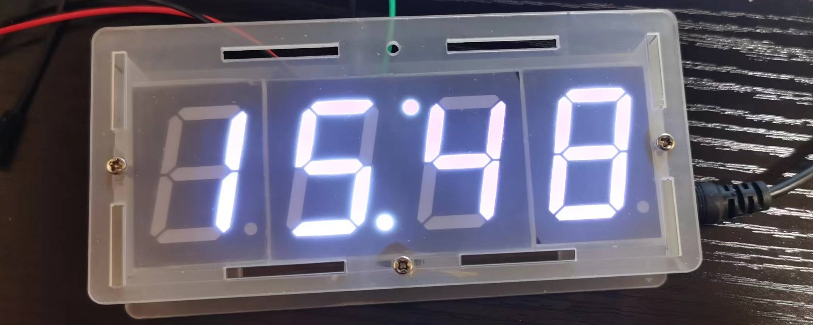
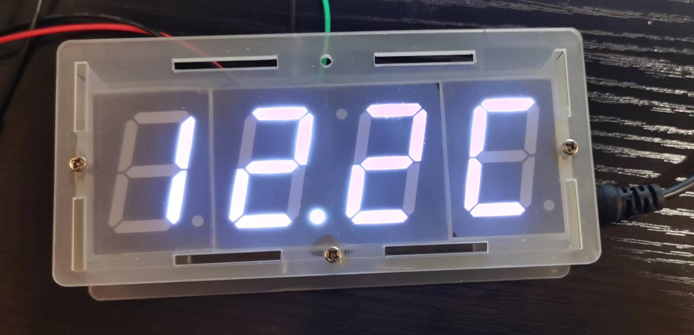
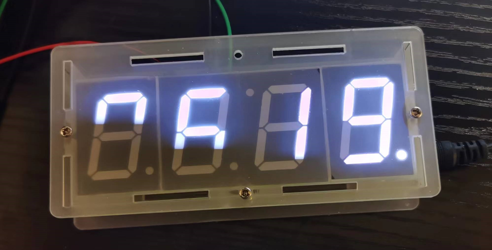

# 自制电子时钟

## 想法来源

​		有一门课叫电装实习，因为疫情，也没有办法正常上课，上的也不过瘾，于是就产生了自己动手的想法。就在淘宝上买了一些专门用来教学的套件，自己也可以顺便学一学相关的知识。分析了源代码，逻辑分析清楚后，就自己修改了。

## 资料

### 原理图

### 硬件清单

|    名称    |    型号     | 数量 |
| :--------: | :---------: | :--: |
|   数码管   |     1寸     |  4   |
|   三极管   |    S9012    |  1   |
|    电阻    |     10K     |  3   |
|    电容    |    22pf     |  2   |
|  热敏电阻  |             |  1   |
|  光敏电阻  |             |  1   |
|  轻触开关  |             |  2   |
|   单片机   | stc15f204ea |  1   |
|  电源接口  |             |  1   |
|   蜂鸣器   |             |  1   |
|   芯片座   |     28P     |  1   |
|   芯片座   |     8P      |  1   |
|  时钟芯片  |   DS1302    |  1   |
|  1220电池  |             |  1   |
|    晶振    |  32.768Khz  |  1   |
| 纽扣电池座 |    插件     |  1   |
|  3.5电源   |             |  1   |

## 开始使用

### 功能

- 时间显示

- 温度显示

- 光强显示

## 使用

### 方法

1. 开始界面：时间、温度、光强度循环显示，按开关2可以使时间初始化
2. 按开关1：只显示时间，按开关2可以使时间初始化
3. 按开关1：只显示温度
4. 按开关1：只显示光强度
5. 按开关1：调整时模式，按开关2：时加一
6. 按开关1：调整分模式，按开关2：分加一

### 说明

1. 起始时间设置的是0分0秒，这样也就相当于一个计时器；如果想要当时钟，就需要一直供电。
2. 本来是带有蜂鸣器的，但是感觉用处不大，就没有使用。

## 结语

​		代码是在源码的基础上修改的，其实很多东西我都不知道为什么要那么写，只是复制、粘贴而已。对于一些简单的，就是自己写的。	

​		做这个之前，好多东西都不懂，自己根据源码去理解，实在不懂的就去百度搜索，确实就走了很多弯路，花了很多时间，但是也学到了很多。
